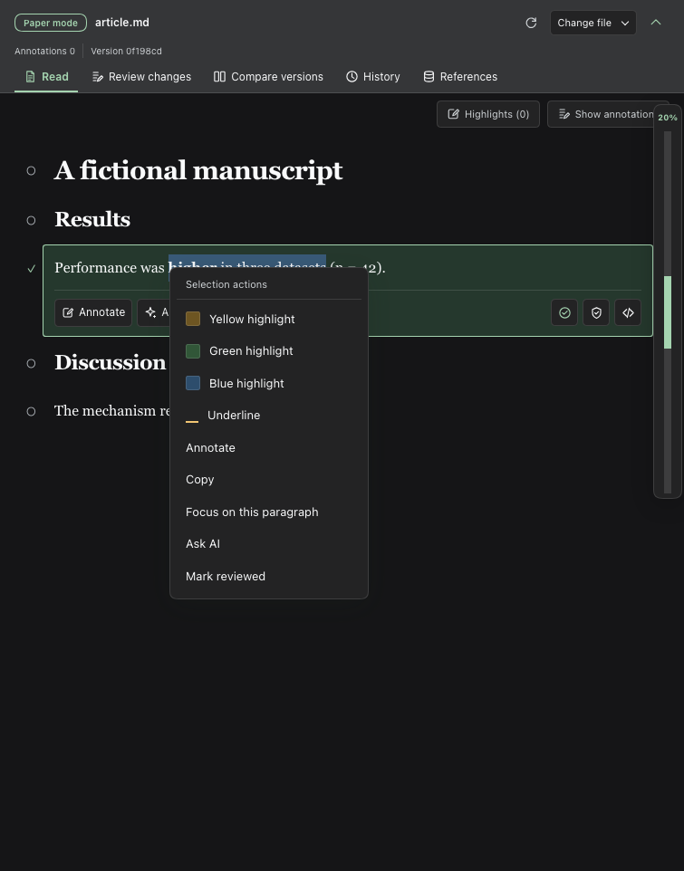
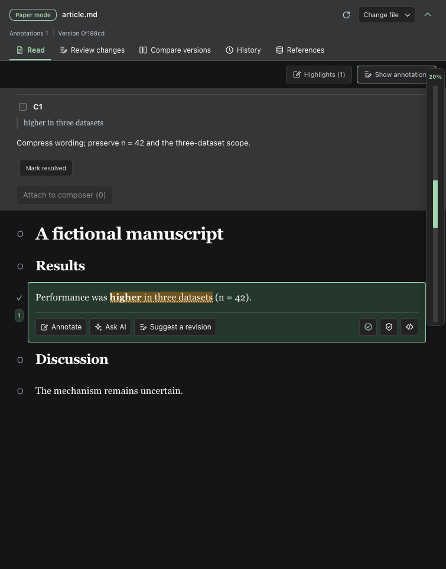
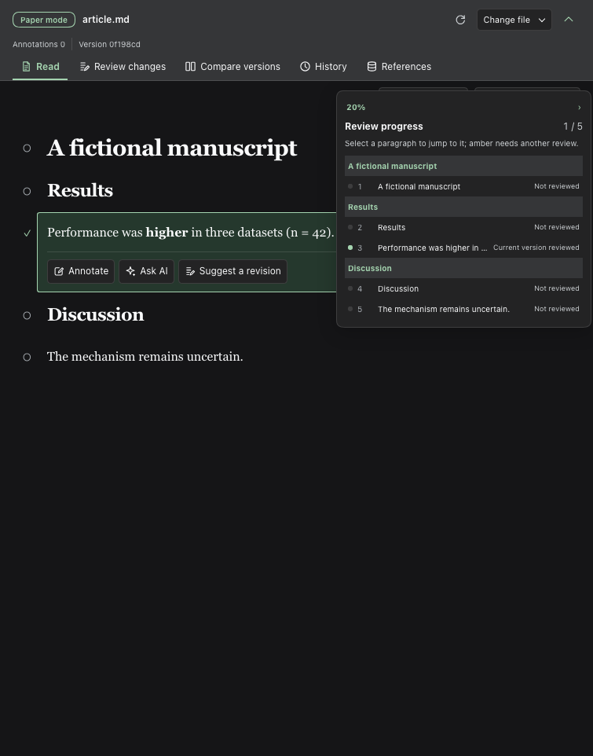
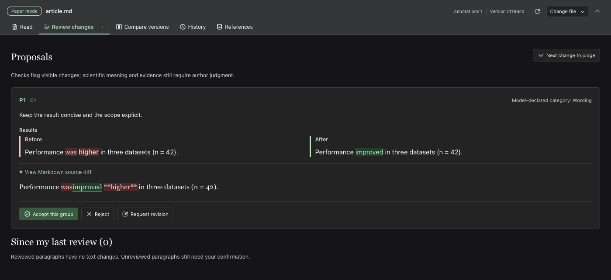
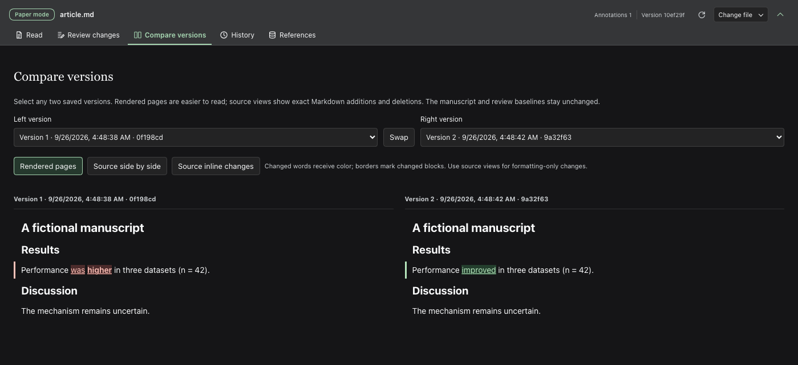

# @deepseek-ai/dsh-experimental-paper-review

[English](README.md) | 中文

## 概述

在原生会话旁阅读 Markdown 稿件，积累批注并请求局部修改。浮动进度轨可以跳转到章节和段落，不会压窄正文。绑定 `.bib` 文件作为引用键的权威来源，书目索引单独查看。智能体可以打开稿件、管理书目条目，以及新建或修改待审稿件提案。论文模式保留原有工具；有文件写入权限的智能体仍能绕过审阅流程编辑。可把预构建的 Git 版本 tag 安装到 Web 配置。

## 目录

- [使用本包](#use-this-package)
- [理解实现](#understand-the-implementation)
- [进一步阅读](#further-exploration)
- [模型体验](#model-experience)
- [已知限制与暂缓工作](#known-limitations-and-deferred-work)
- [开发备注](#dev-note)

-----

<a id="use-this-package"></a>
## 使用本包

使用 DSH 的配置管理命令安装预构建的版本 tag：

```sh
dsh plugin --profile web add 'github:Biogod2020/dsh-article-review#v0.1.7-alpha.8'
dsh web
```

安装器会把本包的[组合包配置](cordis.patch.yml)加入 Web 层之后。若 Web 配置正在运行，安装后需要重启；无需额外启动器或模型配置。这个独立维护的插件已在 macOS 上使用 DSH `0.1.6-alpha.2` 完成启动检查。`main` 分支是带有 `workspace:^` 依赖的开发源码，不能直接作为 Git 安装目标；请固定版本 tag。本地开发时，先在包含此包的兼容 [DeepSeek Harness](https://github.com/deepseek-ai/deepseek-harness) 工作区构建，再运行 `dsh plugin --profile web add /absolute/path/to/deepseek-harness/packages/experimental/paper-review`，并保留该工作区。

### 运行截图

以下画面截自实际运行的 Web 插件，使用虚构稿件和脚本生成的智能体输出。文字、数字、批注与修改均为合成示例，不含个人稿件或私有工作区路径。

选中文字后右键，即可打开高亮、批注和辅助阅读操作。



在选中的文字上保存批注，不会直接改动 Markdown 原文。



展开浮动审阅进度轨，查看各段状态并跳转到相应章节。



接受提案或要求重做前，先看逐词变化和 Markdown 源码差异。



用渲染后页面比较两个历史版本，变化只在对应的词上着色。



### 配置

默认稿件目录是当前会话的本地工作区。已保存会话可以在服务器重启后重新打开稿件，无需先向模型发送消息。可在配置中覆盖 `paper-review` 项。随附的[审阅配置层](review.overlay.yml)仍可通过显式 `DSH_PAPER_REVIEW_ROOT` 用于隔离开发；原生安装不需要它。

| 字段 | 默认值 | 含义 |
|---|---|---|
| `workspaceRoot` | 会话工作区 | 可选的固定本地稿件目录 |
| `maxBytes` | `1000000` | 稿件的 UTF-8 字节上限；最大 `2000000` |
| `maxFigureBytes` | `67108864` | 单张换图快照的字节上限；默认 64 MiB |

选择本地工作区并打开会话右侧栏。选择**阅读、批注与局部修改**，点击**选择 Markdown 文件**即可在 DSH 宿主的 macOS 上弹出 Finder 文件选择窗口，也可以输入 `article.md` 等相对 `.md` 路径。宿主会验证所选文件位于工作区内，并拒绝越界符号链接。在非 macOS 宿主上，该按钮会打开内置工作区浏览器，每个目录最多列出 500 个可见文件夹和 Markdown 文件。智能体可用 `paper_list` 和 `paper_open` 选择已知的工作区路径；本轮结束后，所选稿件会出现在侧栏。选择会在重启后保留。点击**退出论文模式**会隐藏稿件操作工具，但不会删除审阅记录；智能体运行时不可退出。稿件必须位于工作区或显式配置的审阅目录内。

打开稿件后，顶部保留审阅标签，同时收起文件操作。点击**更换稿件**可重新显示路径、文件选择器和退出按钮；阅读时点击工具栏上的折叠箭头，顶部只保留一条窄的稿件栏。工具栏的展开状态在重载后保留。各视图的位置、对比版本及布局在本浏览器中跨视图切换和刷新保留；回到**阅读**时，懒加载完成后仍恢复到原来的可见段落及段内偏移。主动定位提案、目录或搜索结果时，以目标位置为准。导航和重要审阅决定同时显示图标与文字；刷新、确认已审、锁定和查看源码等紧凑控件只显示图标，但保留悬停提示和无障碍名称。较窄的面板只显示标签图标。Markdown 开头的来源注释在阅读页默认折叠为**稿件来源说明**，展开后可查看原文。这些显示操作不会修改稿件或审阅记录。

焦点在审阅面板内时，在 macOS 按 ⌘F，在其他系统按 Ctrl+F，即可搜索当前视图：阅读、审阅修改、版本对比、历史或文献库。查找会显示懒加载或分页中的结果，高亮已挂载的匹配文字，并跳到当前命中位置。点击**转到全文查找**可切到阅读页。按回车、Shift+回车或箭头逐项跳转。按 Escape 关闭查找并清除临时高亮，不修改正文或已保存高亮。焦点在文本输入框或其他面板时，不接管快捷键。匹配过多时最多显示前 2,000 处。

### 审阅流程

1. 在同一段内选中文字后右键，可选择黄、绿、蓝三色高亮、下划线、批注、复制、专注阅读或 AI 上下文。行内格式和重复短语会保留实际选中的位置。高亮和批注不会修改正文。高亮列表支持移除与恢复。点击段落仍可使用原有操作按钮。
2. 确认段落已审，或已审并锁定。这会保存人工审阅基线。锁定会阻止本插件为该段提交和接受修改。再次确认已审会保留锁定，只有**解锁**才会解除它。右侧的窄进度轨显示可审阅段落比例及状态，不改变正文宽度。点击进度轨任意位置即可打开层级稿件目录，逐层展开标题后才会显示小节和段落；点击标题或段落即可跳转，也可**全部展开**或**全部收起**。绿色表示当前文字已审，灰色表示未审，橙色表示审后有修改。文末书目和来源注释不计入分母；接受修改后，重新审阅前进度可能回退。
3. 打开**审阅变更**，阅读每组提案中 Markdown 渲染后的修改前后正文；变化的可见文字会局部着色。每处修改都显示所在章节路径、在可审阅全文中的大致位置及原文锚点预览。点击**在全文中查看**会切回阅读页，滚动到精确锚点，并标明新增内容应在它之前还是之后；替换则标明受影响的段落。懒加载的 Markdown 渲染完成后，阅读器会校正滚动位置；点击**返回提案**可回到原来的提案卡片。若锚点已与当前显示版本不符，跳转会禁用，不会猜测位置。对比内容会在接近可见区域时载入；滚动到提案处即可检查。展开**查看 Markdown 源码差异**可核对精确的逐词变化及格式语法变化。你或智能体都能逐组接受或拒绝；`paper_decide` 仅应在你要求接受时使用。接受会修改文件，但不会把结果标为已审。如需改进待审提案，可点击**要求重做**或让智能体调用 `paper_revise`：它会保留原提案 ID、重新检查且不修改正文。已接受或已拒绝的提案不能再改。
4. 检查**相对我最后审过的内容**，确认后再把修改后的段落标为已审。连续接受多轮修改，仍然相对于此前的人工基线比较。
5. **检查更新**会刷新提案信息。会话轮次结束后也会检查。外部文件变化不会替换当前阅读内容，直到你选择**载入新版本**。
6. 打开**版本对比**，任选两个已保存版本。**渲染后并排**只给变化的可见文字着色，不再填满整块；细边线提示变化的段落。外部改写的段落可能获得新 ID，因此此视图会在相邻的稳定段落之间匹配足够相似的段落，但只用于文字着色，不会迁移已保存的批注。**源码并排**和**源码行内差异**显示完整 Markdown 原文中的精确增删，包括仅有格式变化的内容。如果段落无法可靠配对或渲染后的文字无法可靠映射，界面仅保留边线而不在正文内着色。交换左右版本可反向比较。此页面不会恢复文件或更新人工审阅基线。窄面板中，左右正文会上下排列。
7. 在**阅读**页，每个图注旁有可收起的小预览，接近可见区域时加载，不把整张大图嵌入正文。点击可全屏查看、缩放、适应窗口或按 100% 查看；放大后可拖动图片。方向键及前后按钮可切换图。右侧浮动图窗仍可在悬停时展开缩略图列表。PDF 预览显示第一页，其他页面可**在 DSH 标签页打开**。阅读版本中的 Markdown 引用决定文件：默认相对稿件解析，开头来源注释明确写有 `Figure PDFs stay in path/;` 时则使用该目录。不提供版本选择或同名文件回退；文件缺失时明确显示失败，不会换成另一张图。重试只重新加载同一个文件。
8. 点击**替换图片**，用 macOS Finder（其他宿主使用工作区浏览器）选择已有 PDF 或图片并填写原因。这会生成待审提案，不写正文。**审阅修改**显示可点击全屏查看的旧／新图缩略图，并提醒核对图注和 panel。智能体可用 `paper_figure_list` 和 `paper_figure_replace`；传入 `proposalId` 原位修改待审提案，保留已有图注编辑。两图按 SHA-256 保存在 `figures/review-assets/`；接受时改 Markdown 目标路径，不覆盖原文件。有快照的历史对比读取副本。图注和正文 callout 仍需单独审阅。请随稿件备份这些图片；拒绝提案仍保留副本。

如需提议删除整段、列表或表格而不重拼 Markdown，先用 `paper_read` 读取该 `blockId`，再用 `paper_delete` 传入返回的 `revision`（作为 `baseRevision`）、`beforeHash`、`blockId` 和原因。可选的 `proposalId` 会把删除补进该待审提案，不替换其其他修改；提案必须基于当前版本，且尚未编辑该区块。宿主会复制精确原文、检查哈希与作者锁定，并保持待审状态。只有作者要求接受后才会删除正文。若只删除段内部分文字，仍使用普通提案工具，传入完整精确的 `before` 和删减后保留的 `after`。

### 文献与 BibTeX

打开**文献库**，可通过路径绑定工作区中的 `.bib` 文件；在 macOS 的 DSH 宿主上也可用 Finder 选择。此页显示条目索引，并提示缺失的 `[@key]` 引用和疑似旧式裸引用键。阅读器会隐藏 Markdown 中顶层的 `References` 或 `Bibliography` 章节，但不会从原文或版本历史中删除它；权威来源是绑定的 `.bib` 文件，而不是该显示章节。正文使用 `[@key]` 或 `[@first; @second]`；阅读页把已解析的引用显示为作者—年份，不改已保存的 Markdown，未知或信息不完整的条目仍显示引用键。稿件提案新增的引用必须在绑定文件中存在；新引入的裸年份式键和 `[cite: key]` 写法会被拒绝。已有旧格式正文不自动改写，但会提示迁移。智能体可通过 `paper_bib_*` 工具查找、绑定、列出、读取、新增及替换 BibTeX 条目；新增或替换会直接写入已绑定的 `.bib` 文件，不产生稿件提案。工具会检查语法和键唯一性，但不会独立核实出版信息或文献能否支撑论断。稿件正文修改仍走原有提案和接受流程。

可按标题、作者、年份或引用键筛选，每页显示 40 条，切换视图后保留筛选和页码。条目的引用导航可跳到正文中的引用位置。面板查找能显示当前筛选或分页之外的命中条目。

批注可把所选段落及相邻段落附到普通输入框。附加上下文不会发送内容；提交给已配置的模型提供商前，请检查草稿。选区菜单支持方向键、回车和 Escape；点击外部或滚动阅读区会关闭菜单。

阅读区、批注、选区菜单和版本差异会即时跟随 DSH 的**浅色**、**深色**或**跟随系统**外观设置。高亮与增删文字使用各配色方案对应的颜色。插件不保存独立的主题偏好。

未发送的批注草稿会在本浏览器中按会话和稿件分别保留，切换段落、视图或刷新不会丢失。**收起并保留草稿**保留评论，**丢弃草稿**移除它。**本地草稿**列出保留的评论，包括原段落已消失的草稿。原文变化后，必须明确将草稿关联到当前段落才能保存；这会清除过期引文，但保留评论。浏览器存储失败时会显示提醒，请离开前复制文字。打开另一稿件会清空已勾选的批注，不清除其保留草稿。

网络响应丢失后，**检查操作状态**会先读取服务器当前状态，再决定是否提供重试；已接受或拒绝的提案不会再次发送。审阅基线无法匹配当前段落时，**整理已审记录**可归档记录，或将它关联到你明确选择的当前段落。两种操作均保留原文；关联不会把变化后的文字标为已审。已归档记录仍可恢复。这些恢复操作不会修改稿件。

在 DSH 0.1.6 中，上下文会追加到现有纯文本草稿之后。如果草稿含有文件或会话引用卡片，插件会保留原稿不变，并提示先发送或清空草稿。新版输入框可以在插入时保留这些引用。输入框正忙时会拒绝附加，不修改草稿。

高亮、批注、原始引文、版本、决定、基线、锁定状态以及各会话最后点击的段落保存在 `<workspaceRoot>/.paper-review/`。请随稿件一起备份这个私有目录；其中包含完整草稿和评论，不应进入公开 Git 历史。浏览器按会话和稿件保存路径、各视图阅读位置、版本选择、文献筛选及未发送批注草稿；这不是跨设备备份。接受提案时，请勿同时在另一应用中编辑同一稿件。

-----

<a id="understand-the-implementation"></a>
## 理解实现

<details>
<summary>实现内部说明 — 点击展开</summary>

[宿主端](src/index.ts)在智能体原有工具之外增加稿件发现、审阅及 BibTeX 工具。经过认证的作者请求使用 Connection 的 `/api` 通道；模型工具从执行中的智能体取得会话标识。已启用会话及所选稿件路径保存在工作区私有审阅目录中，恢复会话时会先恢复这些状态。退出会隐藏活跃稿件工具，但保留审阅记录和普通工具。未启用的会话仍可使用 `paper_list` 与 `paper_open`。插件不会覆盖 DSH 已配置的权限，段落锁也不能阻止其他工具直接写文件。

[存储](src/store.ts)串行处理操作，并通过系统级锁独占工作区；服务退出或崩溃后，系统会释放这把锁。旧版插件留下的 `owner.lock` 若记录的进程仍在运行，就会阻止启动；若进程已停止，新版插件会在持有系统级锁时继续，并在正常关闭时清理旧锁。无法验证的锁记录仍需人工检查。服务可能正在使用工作区时，不要删除 `owner.kernel.lock`。原位修改提案时会检查当前阅读版本、磁盘原文、批注、精确段落原文和锁定状态，只更新私有审阅状态；未提供的字段保持不变，提供 `edits` 时则替换整组修改。对已过期的待审提案，可提供新的基线版本及与当前段落原文完全匹配的整组修改，在原提案中重新对齐；ID 和待审状态不变。无关修改产生新版本后，只要锚点 id 和精确原文仍一致，插入提案就仍可接受。接受时在当前锚点旁插入；锚点变化、消失或锁定时仍拒绝。接受前会再次检查原文和锁定状态。随后保存恢复日志、原子替换原文、提交状态并删除日志。重启时，原文与操作前后任一哈希匹配即可处理被中断的接受；第三种哈希会拒绝后续操作，保留日志供人工协调。

[Markdown 解析器](src/document.ts)保留原文偏移并分配持久段落 id。唯一且未变的段落可以跨插入操作保留身份；接受的替换显式保留身份。遇到不明确的外部重写，批注会脱离定位，不会猜测。[面板](src/client/panel.tsx)使用原生侧栏和输入框，不修改 DSH 核心包。不发布运行时不变量配套模块：存储验证持久化状态并拥有全部状态转换，没有需要协调的独立运行时缓存观测。

[选区阅读器](src/client/reader-text.tsx)仅在可见滚动区域附近挂载 Markdown，并通过 CSS Custom Highlight API 绘制 DOM 范围，不向 React 管理的文字中插入标记。阅读页和渲染后的对比页会把使用长破折号分隔行的管道表格显示为表格，不修改已保存的 Markdown 或区块身份。表格发生变化时只显示区块边框，不做逐词着色。渲染后选区保存偏移、引文、前后文和精确段落原文。该段原文发生任何变化时，选区都会标为待重新定位，不猜测格式如何变化。现有私有 schema-version-1 记录可继续读取，高亮列表默认为空；旧的原文批注沿用其匹配规则。移除高亮可以恢复。绘制注册和菜单监听器会随组件释放。

[审阅面板](src/client/panel.tsx)始终显示提案摘要、风险标记和决定按钮，但会延后挂载屏幕外的对比内容。每组对比只解析一次两侧内容；精确的 Markdown 源码差异仅在展开时计算。不支持 IntersectionObserver 的浏览器会立即渲染全部对比。

[图引用](src/figures.ts)从明确图注及普通 Markdown 图片中提取。宿主限制路径和快照目录位于工作区内、限制快照字节数，接受前再次核对哈希。保留的旧图不受原文件后续变化影响；没有快照的历史版本无法恢复此前被覆盖的图片。[小预览](src/client/figure-preview.tsx)接近可见区域时加载，收起或卸载后释放 blob URL。PDF 首页用 macOS `sips` 或 Poppler `pdftoppm` 生成有界 PNG；没有转换器时仍可用 DSH 原生标签页查看。预览失败不会选择另一张图。

</details>

-----

<a id="further-exploration"></a>
## 进一步阅读

- [实验包](https://github.com/deepseek-ai/deepseek-harness/blob/master/packages/experimental/README.md) — 可选发布与依赖策略。
- [Web 组合包](https://github.com/deepseek-ai/deepseek-harness/blob/master/packages/bundle/web-app/README.md) — 承载此插件的配置。
- [存储专项测试](tests/store.spec.ts) — 原文冲突、定位、锁定和人工基线。
- [真实组合测试](tests/composition.spec.ts) — 脚本化 agent loop（智能体循环）调用、认证和资源释放。
- 浏览器测试位于 DSH 工作区，不在此源码仓库内。

-----

<a id="model-experience"></a>
## 模型体验

### 稿件工具

#### 模型看到什么

打开稿件前，模型就能使用 `paper_list` 和 `paper_open`。启用审阅后，还会收到原生 `paper_read`、`paper_annotations`、`paper_propose`、`paper_revise`、`paper_delete`、`paper_check`、`paper_decide` 和六个 `paper_bib_*` schema；精确 schema 保存在[组合测试快照](tests/__snapshots__/composition.spec.ts.snap)中。读取结果包含精确区块 id、原文、版本和锁定状态。插入时用 `insert-before` 或 `insert-after`，`before` 填锚点的精确原文，`after` 可填完整 Markdown 片段，包括列表、表格、引用块、代码和多个区块。省略 `operation` 可用完整 Markdown 替换区块，也可把 `after` 设为空字符串来提议删除。兼容旧调用：若 `after` 含未改动的锚点及用空行分隔的新区块，也会按插入处理。提案返回 id、状态、词面提示及 `manuscriptWritten: false`。检查结果说明待审修改是否仍匹配未锁定原文；提供提案 ID 后还会返回该提案的完整内容。`paper_revise` 保留提案 ID，不修改稿件。`paper_decide` 可在冲突检查后拒绝或接受待审提案。BibTeX 新增和替换只写已绑定的 `.bib` 文件，并返回 `metadataVerified: false`。模型仍保留 DSH 权限模式允许的普通工具。 `paper_figure_list` 读取精确图引用及快照哈希；`paper_figure_replace` 保留两张图并返回 `originalFilesWritten: false`，不改图注。传入待审 `proposalId` 可改其图片目标路径并保留其他编辑；接受仍由 `paper_decide` 核对原文、锁定状态及快照哈希。

#### Token 影响

打开稿件前可用两个发现 schema；启用后在普通工具之外增加十五个活跃 schema。退出后下一轮隐藏这十五个 schema，不移除早期结果。全文读取受字节上限约束，按区块读取含邻居；提案查看和修改返回完整修改组。图工具返回路径和哈希，不返回图片字节，模型仍需另行查看图像。BibTeX 索引返回全部绑定元数据。大型文献库、提案和历史会增加结果长度；本地历史没有裁剪上限。

#### KV Cache 影响

稳定工具 schema 可能保留已有可复用前缀；启停插件或修改工具定义可能使其失效。新工具结果追加历史。本插件不保证提供商缓存，也不发起独立复核模型请求。

### 显式附加的局部上下文

#### 模型看到什么

可编辑的用户消息草稿包含路径、阅读版本、选定段落、相邻原文及选定批注。界面语言决定使用哪组[本地化指令](src/client/locales.ts)；英文规则原文如下。用户发送原生输入框草稿之前，不会提交任何内容。

##### 英文编辑指令

```markdown
Only change the selected blocks; insert complete Markdown before or after an exact anchor when the author requests new material. Read with paper_read, then submit each independent change with paper_propose. For an existing pending proposal, inspect it with paper_check and revise it in place with paper_revise; do not create another proposal. Group dependent edits. Preserve numbers, citations and scientific claims unless explicitly instructed. Do not strengthen causality, generalizability, novelty, significance or superiority. If evidence is missing, report it. Never treat a mechanical check as scientific validation.
```

#### Token 影响

附加段落和批注只在提交后形成用户消息。相邻上下文是显式的；此操作不会偷偷附加全文。选择多条批注可能形成较大草稿，用户可以先检查再发送。

#### KV Cache 影响

提交的上下文追加到会话。引文、版本、批注或界面语言的变化会改变新消息，不会改变此前保留的消息。提供商的缓存复用不受本插件控制。

## 已知限制与暂缓工作

<a id="known-limitations-and-deferred-work"></a>

这个本地单作者 Markdown 原型存在以下限制。

- 尚未实现 PDF、Word、LaTeX 原稿、带修订痕迹的文档导出、区块移动以及跨区块 Markdown 引用解析。提案可以替换或删除精确区块，也可在精确锚点旁插入完整 Markdown 片段；相关修改可以分组。
- 数字、引用、图表、方法和论断词检查只是覆盖不完整的词面信号，不是科学审计。真实提供商的修改质量和独立复核模型尚未验证；自动化测试中的模型响应来自脚本。
- 选区限定在一个 Markdown 段落内。跨段选择会明确提示；可分别批注后一起提交。高亮需要支持 CSS Custom Highlight API 的浏览器。段落原文变化后，渲染选区会标为**需要重新定位**，即使引文仍出现在其他位置。尚未实现模糊匹配和手动重定位；请保留旧记录，在目标位置新建。
- 锁定只约束本插件，不约束外部编辑器。不配合的外部写入可能在最终检查与重命名之间竞争。原子替换和恢复日志针对进程中断，不保证突然断电持久性或抵御恶意本地文件系统修改。
- Finder 选择窗口打开在 macOS DSH 宿主上，不会在远程浏览器所在电脑上弹出。远程或无人值守的宿主应通过 `paper_open` 选择已知路径。普通写入工具可以绕过提案审阅；若必须由作者批准，请使用 DSH 权限模式并明确说明要求。
- Git 发行包不会自动安装 `koffi`，因为这个原生依赖只用于 Windows 工作区锁。Windows 上的安装与运行尚未验收；在 Windows 打开稿件前，需先在同一个配置中安装 `koffi`。
- 完整版本和批注持续保留，没有清理机制或稿件恢复按钮。长历史可能占用磁盘并拖慢状态载入；阅读区、审阅对比及渲染后的版本区块在接近可见区域时挂载。文献列表每页最多显示四十条。工作区锁允许一个服务器进程及多个浏览器窗口，不提供多作者同步。
- BibTeX 索引可处理普通完整条目，但不会展开宏或核实书目信息。新增正文引用会在本插件的替换和插入提案中校验，不会拦截其他工具直接写文件。文献库对疑似裸键采取保守提示；科学术语也可能像引用键，需人工判断。

<a id="dev-note"></a>
### 开发备注

<details>
<summary>维护者工作上下文 — 点击展开</summary>

确定性的组合与浏览器测试在不联系模型提供商的情况下覆盖集成流程，不能据此确认科学审阅质量。

</details>
