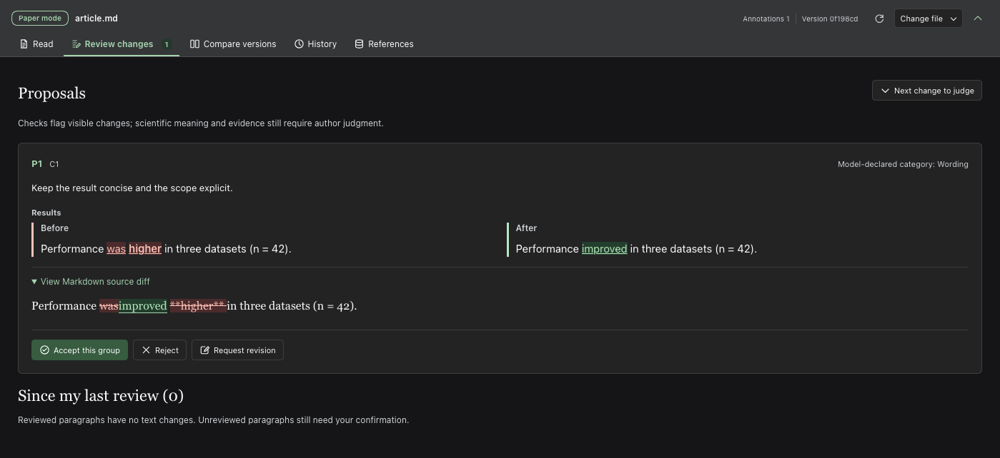
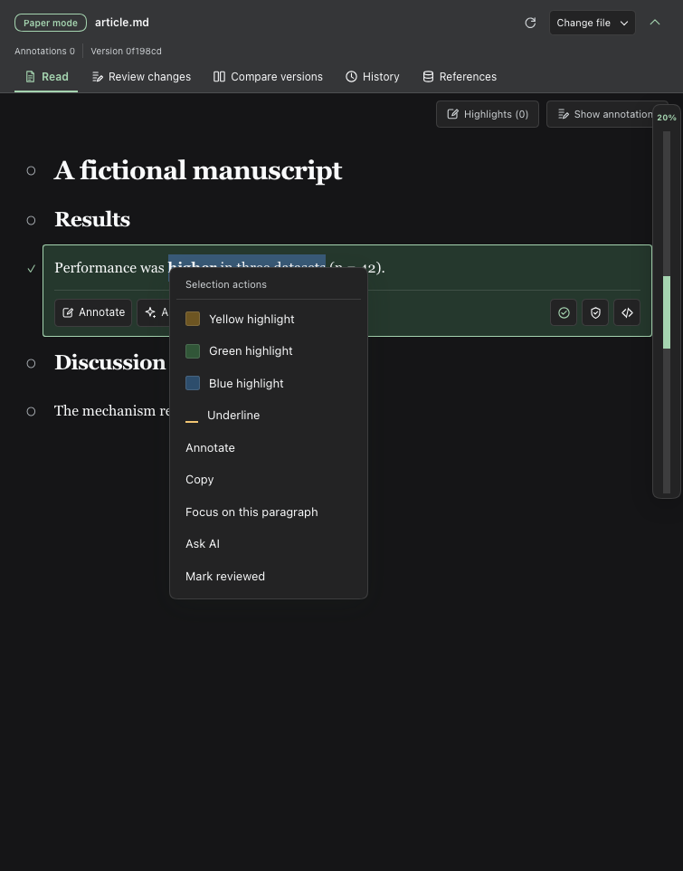
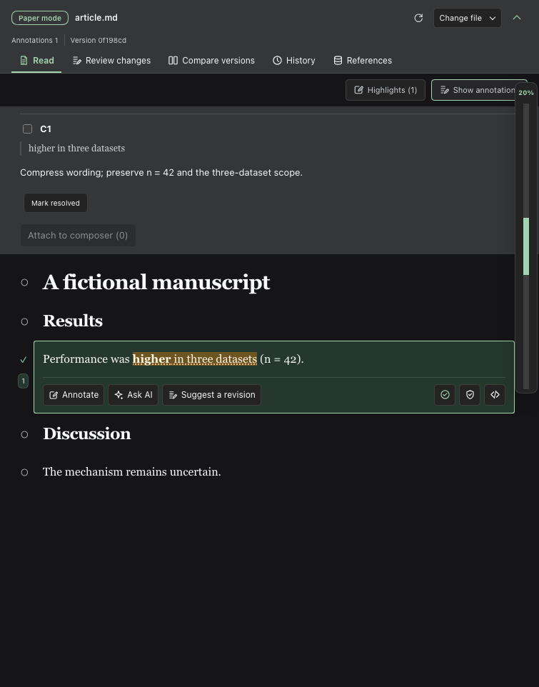
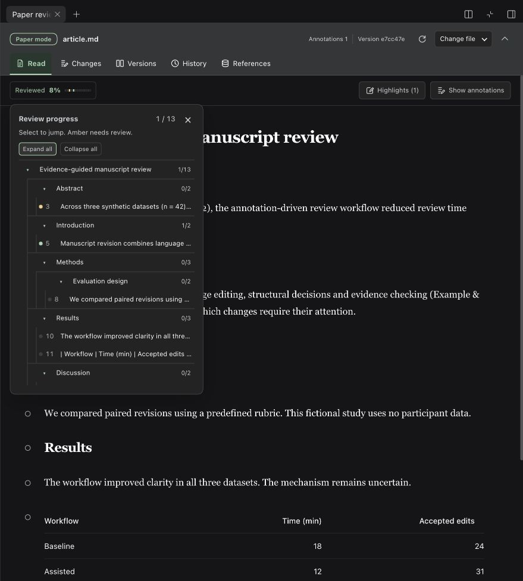
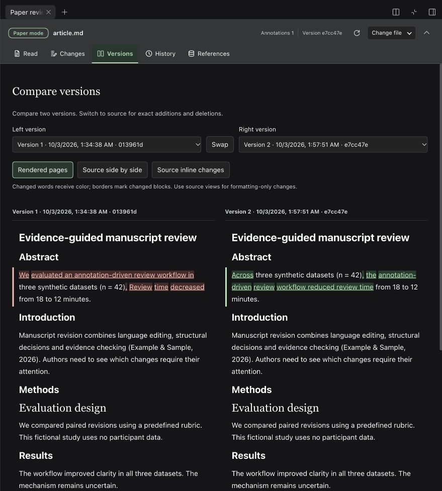
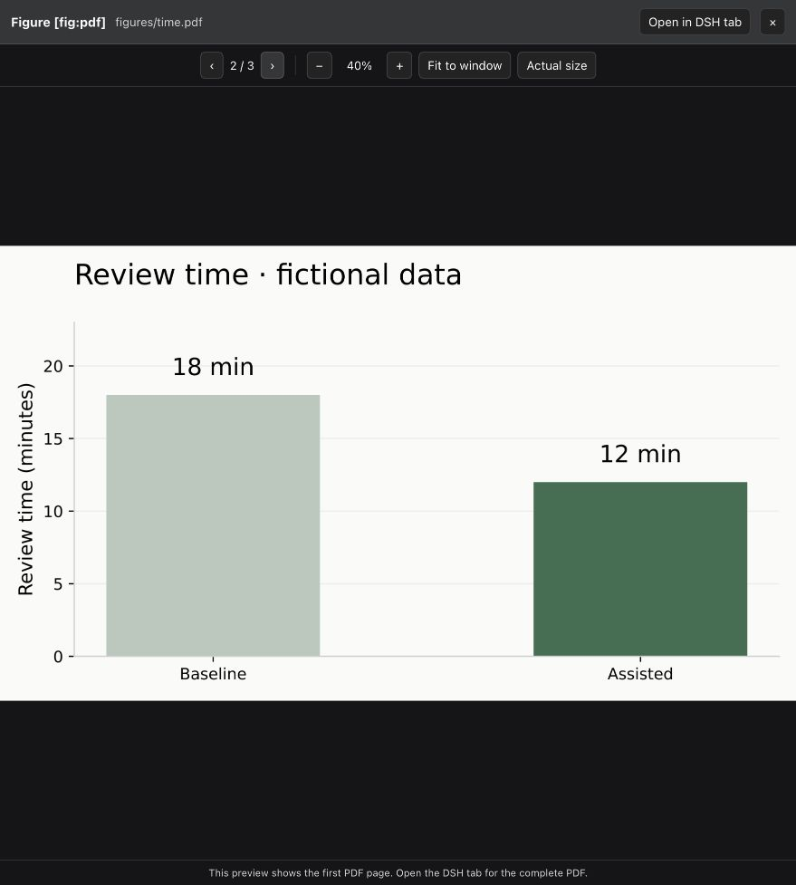
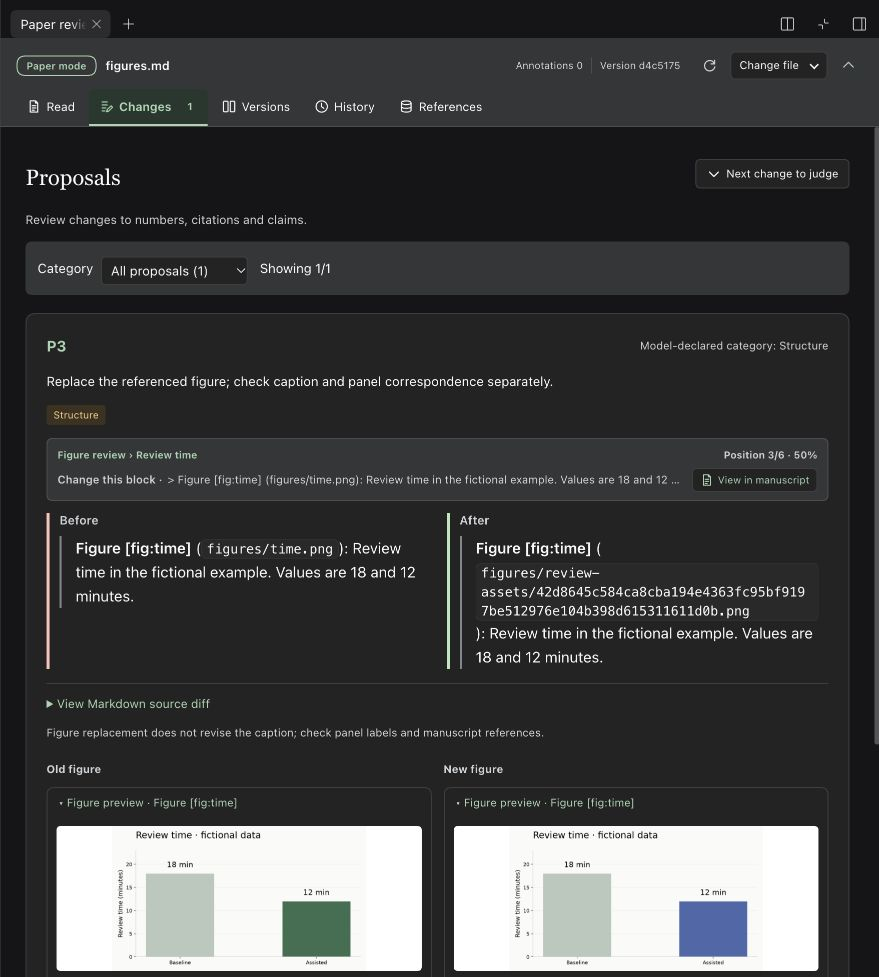
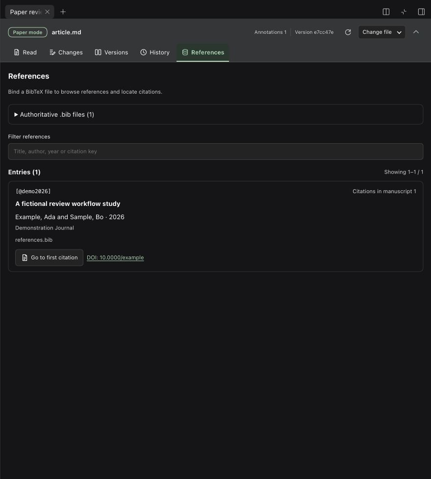
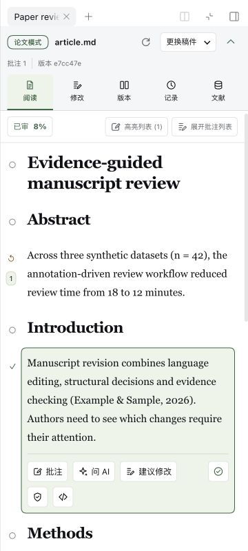

# DSH Article Review

[English](README.md) | 中文

在 [DSH](https://github.com/deepseek-ai/deepseek-harness) 对话旁读论文、写批注、与 AI 逐段修稿。AI 提交修改提案，你查看差异、接受、拒绝或要求重写。

经历多轮修改后，每段仍对照**你最后确认已审的版本**，待审变化一目了然。



*截图使用虚构稿件，含真实模型提案。*

## 核心功能

- **阅读批注**：高亮、下划线、评论与全文搜索。
- **AI 修稿**：替换、增删和重写提案，支持标题、列表、表格。
- **审阅进度**：标记、锁定已审段落，追踪后续变化。
- **版本对比**：逐词对比与 Markdown 源码差异。
- **图表审阅**：预览、提议换图，保留前后副本。
- **文献管理**：绑定 BibTeX，定位引用，检查新增引用键。

<a id="installation"></a>
## 安装

需要 DSH Web `0.2.0-rc.2`、Node.js 22（≥22.19）或 24+，沿用现有模型配置。

```sh
dsh plugin --profile web add 'github:Biogod2020/dsh-article-review#v0.2.0-rc.1'
dsh web
```

安装后重启正在运行的 Web 配置。使用预构建 tag；`main` 是开发源码。

## 开始审阅

1. 在右侧栏选择**阅读、批注与局部修改**，打开 Markdown 稿件。
2. 选中文字添加批注，附到对话输入框，发送修改要求。
3. 在**审阅变更**中接受、拒绝或要求重写，检查后确认已审。

接受提案更新正文，保留已审基线。审阅记录位于 `.paper-review/`，随稿件备份，勿提交公开仓库。段落锁仅约束本插件。

## 操作截图

选中文字，右键添加高亮或批注。



保存批注，把修改要求附到对话。



查看已审进度，跳转章节与段落。



比较两个版本，直接查看字词变化。



预览 PDF、审阅换图、浏览文献。







窄屏也能顺畅阅读。



## 文档

- [使用指南](docs/user-guide.zh.md)：操作与配置。
- [开发与兼容性](docs/development.zh.md)：构建、工具与持久化。

编辑 Markdown 稿件，图表支持图片与 PDF。[其他格式与平台](docs/development.zh.md#scope-and-compatibility)。

[MIT 许可证](LICENSE)
