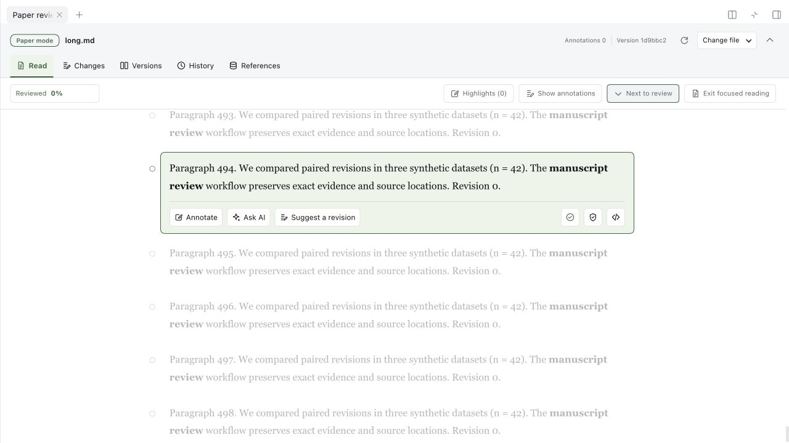
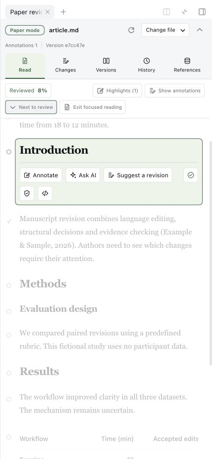

# 轻量审稿体验

2026-10-03 · 插件 `0.2.0-rc.2` · DSH `0.2.0-rc.2` · macOS arm64 / Node 24.16.0。

## 已实现

- **历史按需读取**：日常阅读只传当前正文与版本目录；对比时取选中的两版，交换复用，离开即释放历史正文。切换请求会取消，旧响应不能覆盖新选择。
- **共享可见性观察**：同一滚动区域共用观察器；远处段落保留定位占位，靠近后才解析。已经显示的正文不在滚动时卸载，避免丢选区和跳动。
- **引用按需处理**：远处段落不提前格式化引用，引用索引按书目共享。沿用 DSH 现有 Markdown 缓存。
- **预览复用与排队**：同一 PDF 的重叠请求共用一次转换；按文件身份、大小、修改时间、状态时间和预览尺寸区分缓存。文件替换后重做；默认最多一个转换任务，编码预览缓存上限 4 MiB，可配置为零。最后一个阅读者取消或插件退出时取消工作。
- **直接进入审阅**：工具栏增加“下一处待审”和“专注阅读”；跳转不自动标记已审，当前段落带辅助技术可读取的状态。

## 测量

固定虚构稿件：500 段、24 个版本。`npm run measure:workbench` 比较原来的完整 `PaperView` 和新的浏览器投影，先预热三轮，再取十五轮中位数。

| 项目 | 改前 | 改后 |
|---|---:|---:|
| 单次 JSON 响应 | 5,845,087 B | 236,703 B（减少 95.95%） |
| JSON 解析与校验中位耗时 | 6.82 ms | 0.28 ms |
| 阅读时加载的历史正文 | 24 份 | 0 份 |
| 同一 PDF：三个重叠请求再一次重读 | 4 次真实转换 | 1 次真实转换 |
| 同一滚动区域 1,000 个段落 | 1,000 个观察器 | 1 个观察器 |

响应和耗时由同一脚本在 Node 中测量；不是浏览器帧率或整机内存。PDF 使用生成的测试文件和系统转换器；观察器与渲染次数由生命周期回归测试验证。缓存上限约束保留的编码 URL 与键，并非整个进程 RSS。没有增加运行时依赖或后台轮询，阅读导航和比较不会调用模型。

## 界面验证

真实 DSH 界面打开 500 段长稿，初始显示附近 12 段、保留 497 个定位占位。搜索第 499 段能定位并挂载正文。24 个版本全部可选；快速切换、交换、正文/源码布局、返回阅读和专注/待审跳转正常。版本请求失败时保留选择并提供重试，不用别的正文代替。

已通过 231 项原生集成与界面回归测试、79 项便携测试以及宿主与客户端严格类型检查。430 像素窄屏无水平溢出；跳转在选中段落的操作栏更新后定位。PDF 缩略图与 2200 像素全屏预览正常。

## 配置

在插件的 Cordis 配置中设置 `previewCacheBytes`（默认 `4194304`，`0` 不保留完成的预览）和 `previewConcurrency`（默认 `1`，范围 `1–8`）。待处理的相同文件请求仍会合并。

## 下一优先级

1. **历史存储复用**：当前磁盘仍保存完整版本，宿主读写仍解析整份记录。下一步改为不可变区块复用，并提供显式历史导出/整理；需要迁移、崩溃恢复和旧记录兼容验证。
2. **更快的审阅闭环**：可撤回最近一次接受、按修改风险顺序导航。撤回应创建新版本，保持人审基线与完整记录；不能直接覆盖历史。
3. **超大对比**：先测两百万字符的极端修改，再决定是否把完整源码差异放入可取消 Worker，避免先引入额外线程和常驻依赖。

这些是后续工作，不计入本次已交付结果。
