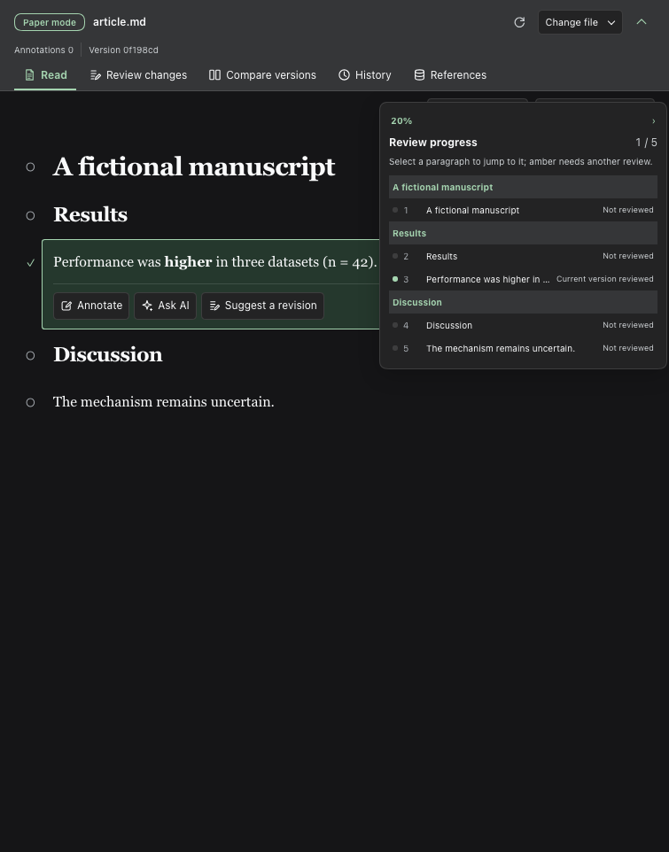
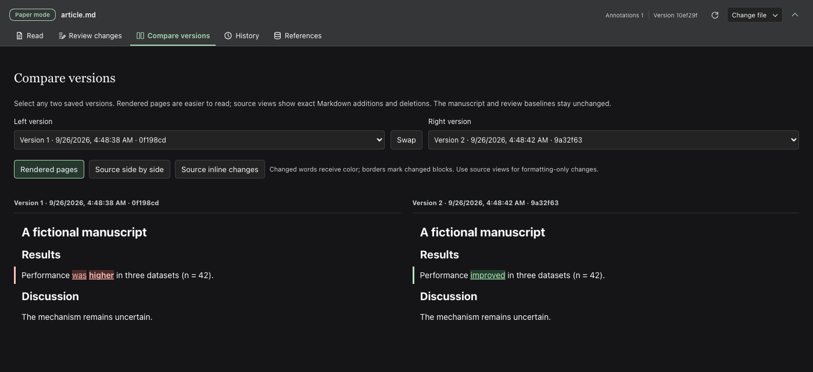

# User guide

English | [中文](user-guide.zh.md)

This guide covers file selection, annotations, proposals, version comparison, figures and references. For installation, see the [project README](../README.md#installation).

## Configuration

The default manuscript directory is the current conversation's local workspace. Stored conversations can reopen manuscripts after a server restart without sending a model message. Optional profile overrides target the `paper-review` row. The [review overlay](../review.overlay.yml) remains available for isolated development with an explicit `DSH_PAPER_REVIEW_ROOT`; it is not needed for native installation.

| Field | Default | Meaning |
|---|---|---|
| `workspaceRoot` | Conversation workspace | Optional fixed local directory containing the manuscripts |
| `maxBytes` | `1000000` | Maximum manuscript UTF-8 bytes; at most `2000000` |
| `maxFigureBytes` | `67108864` | Maximum bytes retained for one replacement figure; 64 MiB by default |

Choose a local workspace and open the conversation's right sidebar. Choose **Read, annotate and revise**, then select **Choose Markdown file** to open the macOS Finder file chooser on the DSH host, or enter a relative `.md` path such as `article.md`. The host validates the selected file inside the workspace and refuses symlink escapes. On a non-macOS host, the button opens the in-app workspace browser, which lists up to 500 visible folders and Markdown files per directory. The agent can use `paper_list` and `paper_open` to select a known workspace path; its choice appears in the sidebar after its turn. The selection survives restarts. **Exit Paper mode** hides the active manuscript tools without deleting review records; it is unavailable while the agent is running. Manuscripts must remain inside the workspace or explicitly configured review directory.

After opening a manuscript, the header keeps the review tabs visible while hiding file controls. Select **Change file** to reopen the path, picker and exit action; use the toolbar chevron to leave only a narrow manuscript bar while reading. The toolbar choice survives a reload. Each view's position, comparison versions and layout survive view changes and reloads in this browser; returning to **Read** restores the visible paragraph and its offset after lazy rendering. Explicit proposal, outline and search jumps take priority. Navigation and major review decisions pair icons with text; compact controls such as refresh, mark reviewed, lock and source use icons with tooltips and accessible names. Narrow panes show icon-only tabs. An opening Markdown provenance comment appears as a collapsed **Manuscript source note** in the reader; expand it to inspect its exact text. These display controls do not edit the manuscript or its review records.

With focus in the review pane, press Cmd+F on macOS or Ctrl+F elsewhere to search the current view: Read, Review changes, Compare versions, History or References. Search reveals lazy or paginated results, highlights mounted matches, and scrolls to the selected occurrence. **Find in full manuscript** switches to Read. Enter, Shift+Enter and the arrow buttons move between matches. Escape closes search and removes temporary highlights without changing the manuscript or saved highlights. Search does not take the shortcut from a text input or another pane. Broad searches stop after 2,000 matches.

## Review workflow

1. Select text within a paragraph and right-click for yellow, green or blue highlights, underlining, annotations, copying, focused reading or AI context. Inline formatting and repeated phrases retain the selected occurrence. Highlights and annotations never change the manuscript. The highlight list offers removal and restoration. Clicking a paragraph still exposes its existing actions.
2. Mark a paragraph reviewed, or review and lock it. This saves the human-review baseline. A lock prevents proposals and acceptance for that block inside this plugin. Marking it reviewed again preserves the lock; only **Unlock** removes it. The narrow floating review rail shows the percentage and color-coded status of reviewable blocks without changing reading width. Click anywhere on the rail to open a hierarchical manuscript outline. Expand headings one level at a time to reveal subsections and paragraphs; select a heading or paragraph to jump there. **Expand all** and **Collapse all** are available. Green means the current text was reviewed, gray means unread, and amber means the text changed after review. Bibliography and source comments do not count; accepting a revision can lower the percentage until you review it again.
3. Open **Review changes** to read each proposal's before and after Markdown with changed visible words colored, alongside the model's declared category and independent lexical warnings. Each edit shows its section path, approximate position in the reviewable manuscript, and an excerpt of its source anchor. **View in manuscript** switches to the reader, scrolls to that exact block, and marks whether new content goes before or after it; replacements mark the affected block. The reader corrects the position after lazy Markdown renders. **Back to proposal** returns to the same proposal card. If the anchor no longer matches the displayed revision, the jump is unavailable rather than guessed. Comparisons load as they approach the viewport; scroll to a proposal to inspect it. Expand **View Markdown source diff** to inspect exact word and formatting-syntax changes. You or the agent can accept or reject each group; `paper_decide` accepts only after your request. Acceptance changes the file but never marks the result reviewed. To improve a pending proposal, use **Request revision** or ask the agent to call `paper_revise`: it updates the same proposal ID, reruns checks and leaves the manuscript untouched. Accepted and rejected proposals cannot be revised.
4. Inspect **Since my last review**, then mark the revised paragraph reviewed only after checking it. Multiple accepted rounds remain compared with that earlier human baseline.
5. **Check updates** refreshes proposal metadata. A completed conversation turn also checks it. External file changes leave the reader fixed until you select **Load new version**.
6. Open **Compare versions** and select any two saved revisions. **Rendered pages** colors changed visible words without filling entire blocks; thin borders identify changed blocks. Externally rewritten blocks may receive new IDs, so this view matches sufficiently similar blocks between stable neighbors for word coloring only; it never moves saved annotations. **Source side by side** and **Source inline changes** show exact additions and deletions in complete Markdown source, including formatting-only changes. If a rendered block cannot be matched or its text cannot be mapped reliably, it keeps its border without inline color. Swap the sides to reverse the comparison. This view neither restores files nor advances human-review baselines. Narrow panes stack the two sides vertically.
7. In **Read**, each figure caption has a collapsible small preview that loads near the viewport, not a full-sized image in the reading body. Click it to view full screen, zoom, fit to the window or inspect at 100%; drag a zoomed image to pan. Arrow keys and previous/next buttons switch figures. The right-edge floating figure window still expands into a thumbnail grid on hover. PDF previews show the first page; **Open in DSH tab** handles additional pages. The pinned Markdown reference chooses the file: paths resolve beside the manuscript unless its opening provenance comment explicitly says `Figure PDFs stay in path/;`. There is no version picker or fallback to a same-named file; missing files show a failure instead of another figure. Retry reloads that same file.
8. Select **Replace figure**, choose an existing workspace PDF or image with Finder on macOS (the workspace browser on other hosts), and give a reason. This creates a pending proposal, not a source write. **Review changes** shows old/new thumbnails, each opening full screen, and reminds you to check captions and panel labels. The agent can use `paper_figure_list` and `paper_figure_replace`; `proposalId` updates a pending proposal while preserving its caption edits. Both files are retained by SHA-256 under `figures/review-assets/`; acceptance changes the Markdown destination without overwriting the original file. Historical comparisons use snapshots when available. Captions and callouts need separate review. Back up these assets with the manuscript; rejection keeps retained assets.

To propose deleting a complete paragraph, list or table without retyping Markdown, call `paper_read` with its `blockId`, then `paper_delete` with the returned `revision` as `baseRevision`, `beforeHash`, `blockId` and a reason. An optional `proposalId` appends deletion to that pending group without replacing its other edits; the group must use the current revision and must not already edit that block. The host copies exact source, checks its hash and author locks, and keeps the result pending. It does not delete manuscript text until author-requested acceptance. To remove only part of a paragraph, use the ordinary proposal tools with exact whole-block `before` and the remaining `after` text.

## References and BibTeX

Open **References** to bind existing workspace `.bib` files by path or, on a macOS DSH host, with Finder. The tab shows indexed entries and flags missing `[@key]` citations or possible legacy bare keys. The reader hides a top-level Markdown `References` or `Bibliography` section without deleting it from source or version history; the bound `.bib` files, not that display section, are the authority. Cite in Markdown as `[@key]` or `[@first; @second]`; in Read, resolved citations display as author-year labels without rewriting the saved Markdown, while unknown or incomplete entries remain visible as keys. New citations in manuscript proposals must resolve in the bound files; newly introduced bare year-style keys and `[cite: key]` notation are refused. Existing legacy text is left intact and surfaced for migration. The agent can find, bind, list, read, add and replace BibTeX entries through `paper_bib_*` tools; adding or replacing an entry writes the bound `.bib` file directly and creates no manuscript proposal. The tools check syntax and key uniqueness; authors verify publication metadata and citation support. Manuscript prose changes still require the normal proposal and acceptance flow.

Filter entries by title, author, year or citation key. The list displays 40 entries per page and retains its filter and page when switching views. An entry's citation navigation jumps to its occurrences in the manuscript. Pane search can reveal an entry outside the current filter or page.

Annotations can attach the selected paragraph and its neighbors to the ordinary composer. Attaching context does not send it; inspect the draft before submitting it to your configured model provider. The selection menu supports arrow keys, Enter and Escape; outside clicks or reader scrolling dismiss it.

The reader, annotations, selection menu and version differences follow DSH's **Light**, **Dark** or **System** appearance setting immediately. Highlights and added/deleted text use scheme-specific colors. The plugin does not save a separate theme preference.

Unsent annotation drafts survive paragraph selection, view changes and reloads in this browser, separately for each session and manuscript. **Close and keep draft** retains the comment; **Discard draft** removes it. **Local drafts** lists retained comments, including those whose original block disappeared. A draft based on changed source cannot be saved until you explicitly attach it to the current paragraph; this clears its outdated quotation, not its comment. Storage failures display a warning so you can copy the text before leaving. Opening another manuscript clears selected annotation checkboxes, not its retained drafts.

After a lost network response, **Check operation status** reads current server state before offering a retry. A proposal already accepted or rejected is not sent again. For a review baseline with no matching current block, **Recover review record** can archive the record or link it to an explicitly selected current paragraph. Both actions retain the original text; linking does not mark changed text reviewed. Archived records remain available for restoration. These recovery actions do not edit the manuscript.

On DSH 0.1.6, attached context appends to existing plain-text drafts. If the draft contains file or session reference chips, the plugin leaves it unchanged and asks you to send or clear it first. Newer composers preserve those references during insertion. Busy composers reject attachment without changing the draft.

Highlights, annotations, original quotations, revisions, decisions, baselines, locks, and the last clicked paragraph per session live under `<workspaceRoot>/.paper-review/`. Preserve this private directory with the manuscript backup; exclude it from public Git history because it contains complete draft text and comments. Browser storage retains paths, per-view reading positions, version choices, reference filters and unsent annotation drafts by session and manuscript; it is not a cross-device backup. Do not edit the same manuscript concurrently in another application while accepting a proposal.

## Screenshots

These captures show the running Web plugin with a fictional manuscript and scripted agent output. The text, counts, notes and edits are synthetic; no personal manuscript or private workspace path is shown.

Select words and right-click to open highlight, annotation and reading actions.

Save an annotation on the selected phrase without editing the Markdown source.

Expand the floating review progress rail to see paragraph status and jump to a section.

Inspect a proposal's changed words and Markdown source diff before accepting or requesting another revision.

Compare saved versions as rendered pages with changes colored at the word level.

